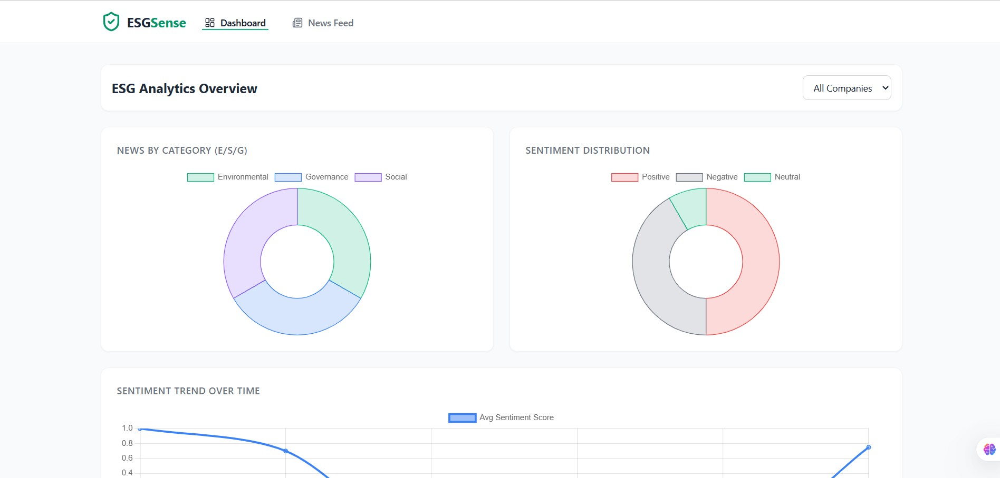

# ESG News Analyzer & Sentiment Tracker

A web application that aggregates ESG-related news about companies and uses AI to analyze sentiment and categorize issues into Environmental, Social, or Governance categories.



## Features

- **Company Search**: Track news for Tesla, Amazon, Microsoft, and more.
- **AI Sentiment Analysis**: Automatically classifies news as Positive, Negative, or Neutral.
- **Auto-Categorization**: Tags articles as Environmental (E), Social (S), or Governance (G).
- **Interactive Dashboard**: Visualizes sentiment trends and category distribution.
- **Responsive Design**: Modern UI built with React and TailwindCSS.

## Tech Stack

- **Frontend**: React (Vite), TailwindCSS, Chart.js, Lucide Icons
- **Backend**: Node.js, Express (Serverless on Netlify)
- **Database**: Mock Data / In-Memory Store (Deployment Ready)
- **AI/NLP**: Heuristic-based text analysis engine (simulating LLM capabilities)

## getting Started

### Prerequisites
- Node.js (v18+)

### Installation

1. **Clone the repository**
   ```bash
   git clone https://github.com/narayan0910/ESG-Sense.git
   cd ESG-Sense
   ```

2. **Setup Backend**
   ```bash
   cd server
   npm install
   node index.js # Start server on port 3000
   ```

3. **Setup Frontend**
   (Open a new terminal)
   ```bash
   cd client
   npm install
   npm run dev   # Start client on port 5173
   ```

4. **Access the App**
   Open http://localhost:5173/ in your browser.

## Project Structure

```
├── client/          # Frontend React Application
│   ├── src/
│   │   ├── components/
│   │   ├── pages/
│   │   └── services/
│   ├── netlify/     # Netlify Functions (Backend logic)
├── server/          # Local Backend (Mirror of Netlify logic)
│   └── index.js     # Server Entry Point
└── docs/            # Project Documentation
```

## AI Implementation Details
See `docs/AI_USAGE_REPORT.md` for details on how the sentiment analysis and categorization logic works.
